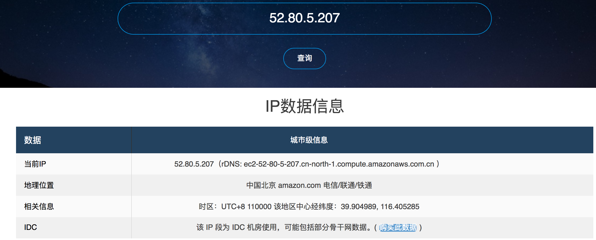
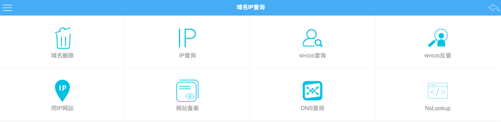
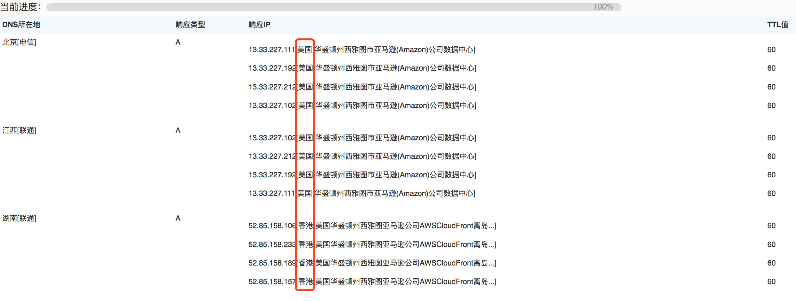
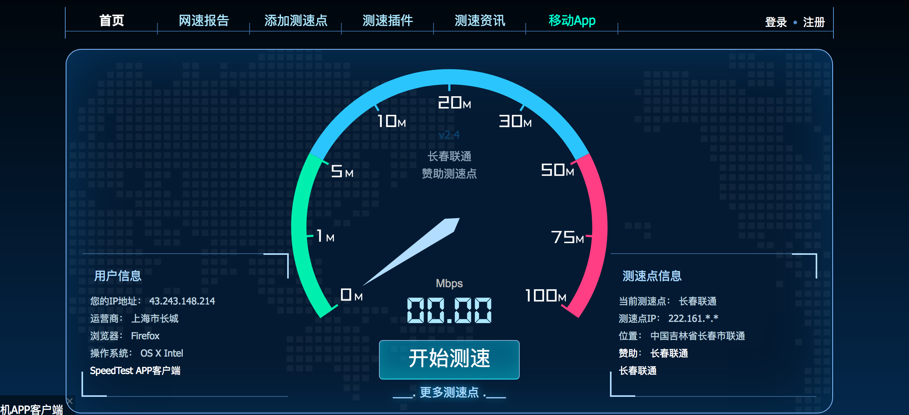

# AWS Network Test Tool  

网络测试工具

| 测IP                                    | 地址                                                 |
| :-------------------------------------- | :--------------------------------------------------- |
| 查看IP地址属于哪里                      | https://www.ipip.net/ip.html                         |
| AWS在全球的公网IP测试（包括北京、宁夏） | http://ec2-reachability.amazonaws.com/               |
|                                         |                                                      |
| **网站备案**                            | 地址                                                 |
| 站长之家 - IP查询、网站备案、DNS查询    | http://m.tool.chinaz.com/ip/                         |
|                                         |                                                      |
| **测延时**                              | **地址**                                             |
| 本地到AWS全球区域的延时                 | http://www.cloudping.info/、http://cloudping.today/  |
| 测试全球各个国家到各个云厂商之间的延时  | https://www.cedexis.com/get-the-data/country-report/ |
| AWS各个区域之间的延时                   | https://www.cloudping.co                             |
| 各个不同国家ping AWS                    | https://asm.ca.com/en/ping.php                       |

